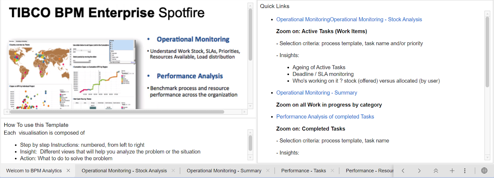

# Sample for TIBCO® BPM Enterprise Analytics Dashboard 

TIBCO Spotfire® enables you to take data from the BPM database and create visualizations, for example, bar charts and scatter plots, based on the data. This enables you to quickly and easily identify trends, patterns and relationships in your data. It provides users with actionable insight on tasks, cases, and processes. When discovering a specific situation (SLAs at risk, an overload of a team etc) business users would want to act to mitigate the risk or seize the opportunity. There are several "actions" that you can do on the BPM platform using the API;  like updating Task priority, allocation task, re-assigning people to organizational units etc which will have a direct impact on the business.

# Dashboards

## Home Page
This landing page which gives you an overview of the different dashboards present in the DXP file as well as provides quick links to the pages. 

Note: This is just a sample dashboard and you are encouraged to update the dashboards that suit your needs, create more analysis tabs, visualizations, add more tables, create more custom fields etc.

## Operational Monitoring - Stock Analysis
This visualization allows you to select a process, a task within that process, and its priority and then view how long it has been outstanding, whether there are any approaching SLAs (service level agreements), and what resources are working on it.

## Operational Summary
This visualization displays a summary of all tasks from all processes. It shows the outstanding tasks, their average duration and their first SLA.

## Performance Tasks
This template allows you to select a task and then displays:
a summary of its duration
a summary of its execution by resource and priority.

## Performance Resources
This template allows you to select one or more resources and a time period. It then displays what tasks those resources have been working on and the duration of those tasks.

## Case Data Analysis
This template allows you to select a Case type and then shows the case states of that Case type selected. You can also see all the cases for that case type created and the case id, sla, case age hour etc for that particular case.

## BPM Enterprise database tables:
The BPM Spotfire template visualizations use the [Event Collector](https://docs.tibco.com/pub/bpme/5.0.0/doc/html/GUID-386D6A92-D8ED-4F35-9C66-89656C72DD11.html) tables of the BPM database schema. The Event Collector is a component of TIBCO BPM Enterprise. It collects and correlates data on business process events. 
The two tables that are mainly used by the BPM Spotfire Template visualizations are:
sc_workitem_status
sc_processinstance_status

A default cdm_cases view for case data is provided in the TIBCO BPM Enterprise database that you can use in TIBCO Spotfire. You can also create your own custom views, based on the default view, if you want to visualize data for a particular case type. Check this doc link for Configuring cdm_cases View in TIBCO Spotfire. 

# Configuring BPME dashboard in TIBCO Spotfire

The analytics file is embedded with information link (sample data) so you can get a quick look & feel of the dashboards. To start analyzing your data, replace the embedded data with your database. 
There are different sources via which data can be loaded in Spotfire see the guide for details, you may choose to select any of them. However in this readme we will cover steps for configuring data source using a Data Connection, here we are connecting via a Postgres Data connection.

 
1. On the authoring bar, click Files and data 
2. Click on ‘Connect to’ and select PostgreSQL and click on ‘New Connection’
PostgreSQL connection dialog box opens and provide Sever, Username and Password details
Now go back to the Data Canvas and on the menu bar, select Data > Data connection properties select the connection you created in step 2 and click on Settings and then Edit your data to add data tables (for more details)
For managing Data connection in Spotfire Library refer to this guide.
Now the data source has been added and you may replace the existing data on the tables. Select a table from the dxp file from dashboard and click on blue data loading icon

6. Next click on the 3 dots loaded data and click on ‘Replace Data Source’ as shown in ss below and then select the table from the new data connection created above.

7. Similarly replace the information link which is embedded in the dxp file with your data source for all the data tables. Check the Information & Data tabs it should now point to your connection and should load your data.

8. There are few tables in the dashboard which has custom columns they might have some node errors, you need to select the gear button and resolve the issue by creating or selecting the appropriate table or column (check transforming data for more details)
eg. sc_workitem_status

9. A default cdm_cases_view is provided in the database though you can also create your own custom view. Here in the dxp in ec_event a custom view called ‘cdm_case_states’ is created with below code. Similarly you may create your custom views for analysing case data.
Eg. custom view - cdm_case_states
SELECT c.casedata ->> 'id'::text AS case_id,
c.casedata ->> 'state'::text AS state,
	c.creation_timestamp,
	c.modification_timestamp,
	t.name
   FROM bpm.cdm_cases_int c
 	JOIN bpm.cdm_types t ON c.type_id = t.id
 	JOIN bpm.cdm_datamodels d ON t.datamodel_id = d.id
 	JOIN bpm.cdm_states s ON c.state_id = s.id
 	JOIN bpm.cdm_applications a ON d.application_id = a.id;
             10. To refresh the Database schema whenever new data is created follow these steps.
Copyright (c) 2021, TIBCO Software Inc.
 
