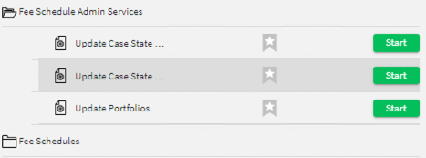
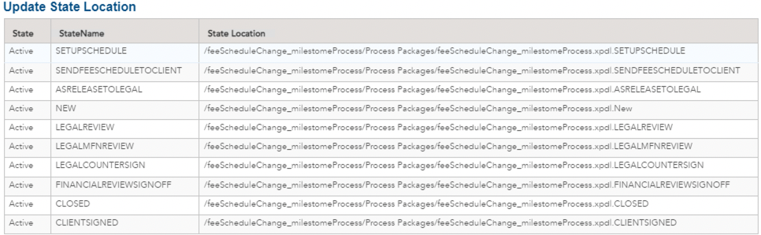
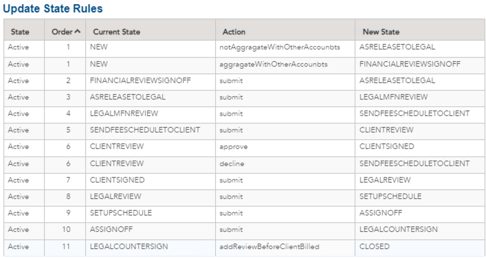
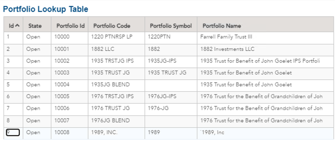

## Case Management Financial Use Case

This demo illustrates how case management can be used to manage a fee schedule change process. This contains the project zip with all the artifacts. In order to run the demo you will have to create the decision tables. See the screenshots below for details on the decision tables.

Youtube demo link - https://drive.google.com/file/d/1XL2c2GaHmIooqw9LxkjDZNzaevGh8xpC/view?usp=sharing

>Before you start working with this sample, you can become familiar with TIBCO Business Studio by completing your First BPM Project tutorial here: https://docs.tibco.com/pub/bpme/5.0.0/doc/html/GUID-FFE072E2-7BEA-4834-BA17-23F6BCAD320A.html

> There is a How to Start with your first Case Management step by step guide here- https://github.com/TIBCOSoftware/bpme-samples/blob/master/how-to/README.md

Fee Schedule Decisions looks like this below. The JSON data is stored in the artifacts folder. These 2 tables are updated in thge Fee Schedule Business services.

The Portfolio Lookup Table is a table that is used to populate some data fields on a form, illistrating a lookup table.

Copyright (c) 2022, TIBCO Software Inc.
