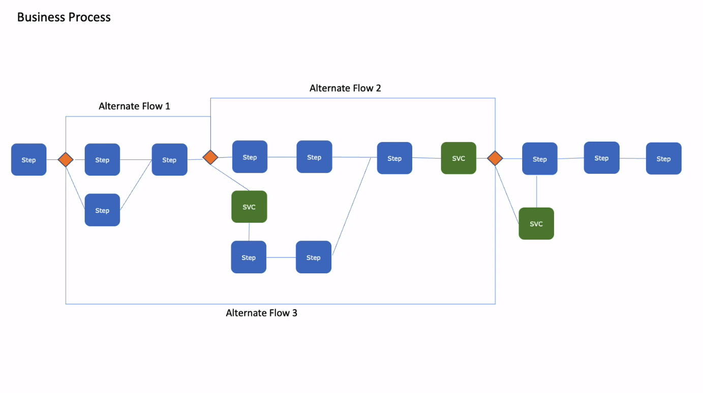

## Dynamic Case Management

Case Management feature is ideal for handling unstructured processes. Historically before Case management capability came in these processes were created using multiple conditional logic & branching and this could have multiple alternate flows which could make it very complex in nature. 

**Checkout explained  Video here:** 

So with Case management approach what has been done is it has simplified the above complexity by breaking these long branches into sub-processes and each of thsese sub-processes would represent milestones in the life of a case and which then can be managed seperately 

Each of these sub-processes can be exposed as events which can be triggered dynamically based on rules, case state change, data change etc
And each of thsese states are managed seperately in the life cycle of complete process

# Case managemnet implementation methodology
 
 

You may refer to Case Management documentation here: 
https://docs.tibco.com/pub/bpme/5.2.2/doc/html/Default.htm#concepts/case-management-1.htm?TocPath=Concepts%2520Guide%257CCase%2520Management%257C_____0

You may refer to Case Data documentation here: https://docs.tibco.com/pub/business-studio-bpm-edition/5.0.0/doc/html/GUID-014A963F-5CC8-4442-8009-E5F3B79F53AA.html

Before you start working with this sample,
>you can become familiar with TIBCO Business Studio by completing your First BPM Project tutorial here: https://docs.tibco.com/pub/bpme/5.0.0/doc/html/GUID-FFE072E2-7BEA-4834-BA17-23F6BCAD320A.html

Copyright (c) 2022, TIBCO Software Inc.
