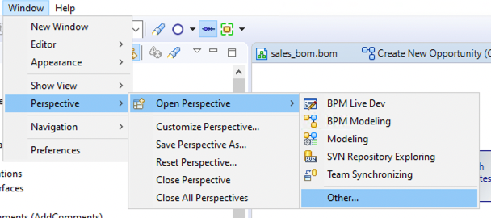
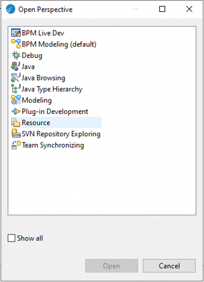

This sections provides instructions to install the eGit Plugin into BPME Studio

## eGit Install
### Important:  
- In BPM Enterprise Studio, make sure to change the perspective to Java or you will not see the install option in the Help menu as expected. 

- Use BPM Enterprise Studio 5.2.1 and above
- Run Studio as Administrator
- There are currently a error in studio that complains that there are files in the repository that should ot be there. Sid in engineering is looking into this.

1, Download Mylyn 3.20 release archive file at this link:
https://www.eclipse.org/mylyn/downloads/archive.php

2, Install Mylyn 3.20 via the archive file downloaded by step 1 on BusinessStudio. Please ONLY select and install the "Mylyn Features" component at the installation.

3, After Mylyn 3.20 is installed and BusinessStudio got restarted, install eGit 5.9 version by using URL https://archive.eclipse.org/egit/updates-5.9. Then you'll be able to select all 3 components that come with eGit 5.9 and all components should be successfully installed then.

Use this link to configure your Git environment
https://eclipsesource.com/blogs/tutorials/egit-tutorial/
