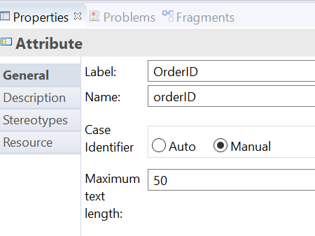

## This sample shows you how to use TIBCO Business Studio to create a business object model for Order Case data.

Case data is business data that is centrally managed and can therefore be accessed and updated by multiple BPM process applications.
Business data is structured data that contains information about real-world entities that an organization deals with, for example: Customer, Order, Orderline, Claim or Policy.

Before you start working with this sample,
>you can become familiar with TIBCO Business Studio by completing your First BPM Project tutorial here: https://docs.tibco.com/pub/bpme/5.0.0/doc/html/GUID-FFE072E2-7BEA-4834-BA17-23F6BCAD320A.html
 

Step 1: Create a Business Data Project

