### Create and Deploy an Order Case Application project

This sample will be using the Organisation Model Project and Business Object model Project in the How-To-samples folder. The project shows an Order case Application which shows how to fetch user details in a form and create a new Order Case for it. Using the ‘UpdateOrder’ Case Action you may update the Case details and Case States.

Before you start working with this sample, 
>you can become familiar with TIBCO Business Studio by completing your First BPM Project tutorial here: https://docs.tibco.com/pub/bpme/5.0.0/doc/html/GUID-FFE072E2-7BEA-4834-BA17-23F6BCAD320A.html
> and try out the Organisation Model Project and Business Object model Project in the How-To-samples folder
 

Step 1: Create a BPM Process Project

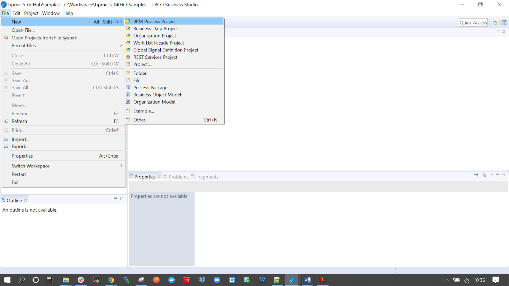

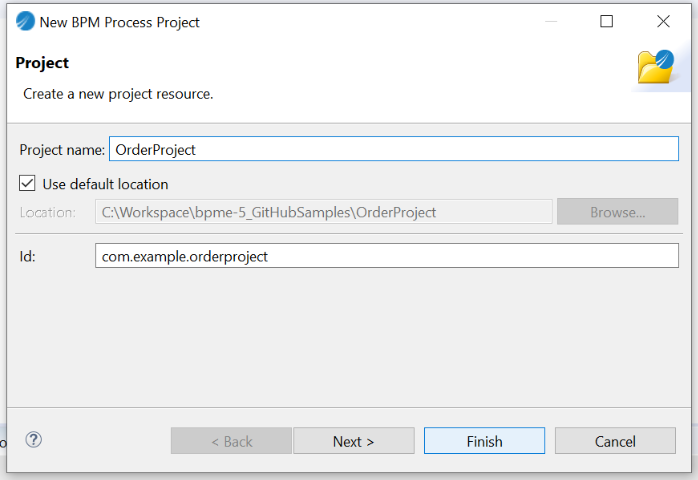

Step 2: Create Local and Global Data Fields

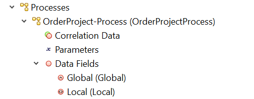

For Local Data - select BOM type and map it to Order (BOM created in Object model Project in the How-To-samples folder)

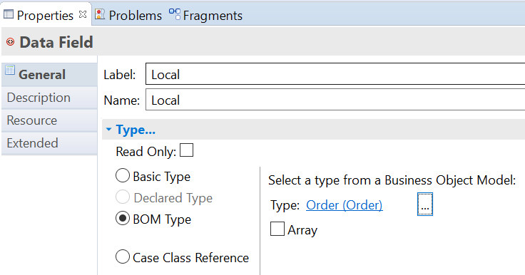     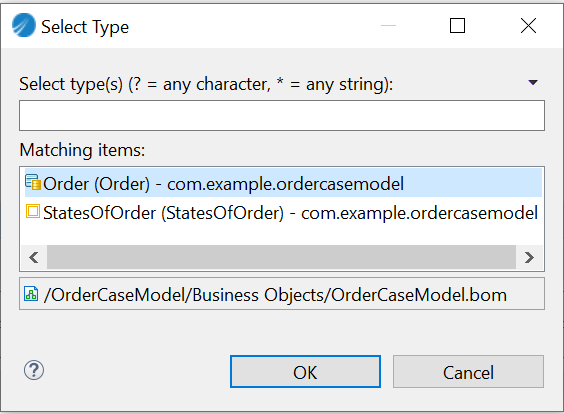

For Global Data - select Case Class Reference and map it to Case Class type: Order

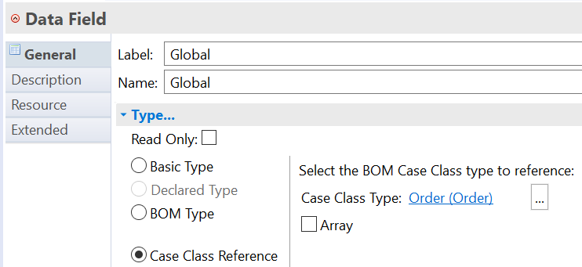

>Check Documentation for further details:https://docs.tibco.com/pub/business-studio-bpm-edition/5.0.0/doc/html/GUID-9F7A9C03-2F47-4269-81D2-883DA14DA3B6.html
https://docs.tibco.com/pub/business-studio-bpm-edition/5.0.0/doc/html/GUID-7708D645-786B-4E4A-8A1D-2AEF2C43343C.html
 
Step 3: Create a Participant
Create a ‘CustomerServiceRepresentative’ Participant which is mapped to External Reference the Customer Service Group of the Organisation Model Project.

Doc reference: https://docs.tibco.com/pub/business-studio-bpm-edition/5.0.0/doc/html/GUID-301FD6F2-0769-4E10-892C-5281B671B160.html

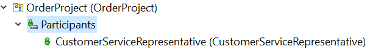

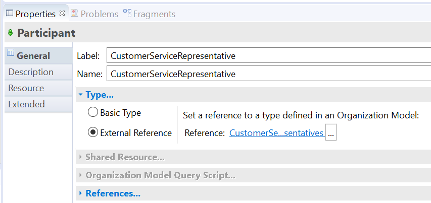

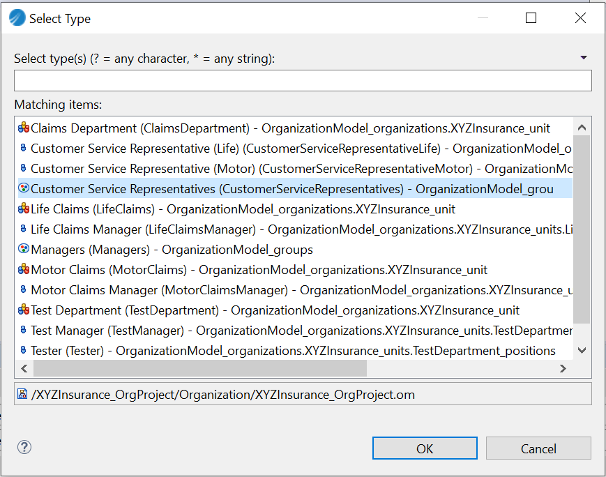

Step 4: Add Tasks to the Order Process Flow

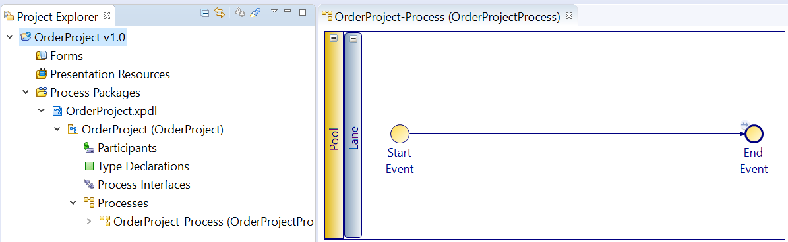

Add a User Task ‘InputOrderDetails’ and map it to ‘CustomerServiceRepresentative’ Participant created in step 3.

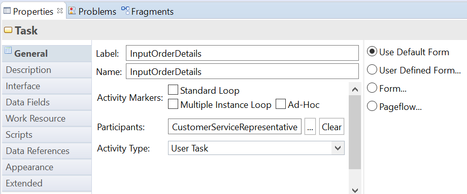

Next Add a ‘CreateOrder’ Service Task and select service type as Case Data Operations
Refer doc to Create a new case Object: https://docs.tibco.com/pub/business-studio-bpm-edition/5.0.0/doc/html/GUID-609577EB-175F-4258-9E18-5C8EA6179D1A.html

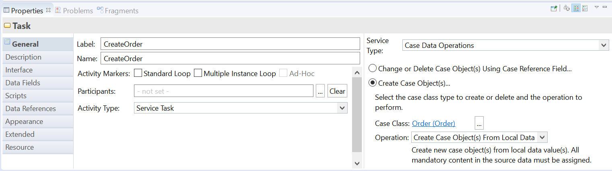

Below will be the complete flow of the process

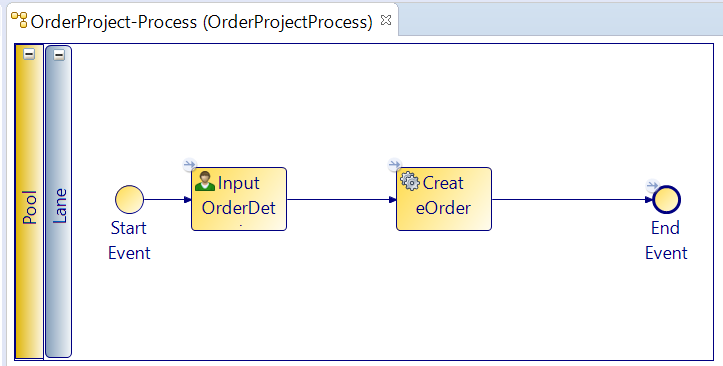

Step 5: Create a Business Service
The Business Service is created so a non-admin user can start the Instance of the Order process and then the WorkItem will be offered to the Participant as per Capabilities and Privileges assigned in the Organisation model.

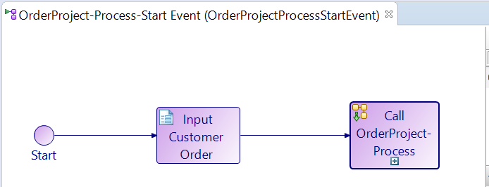

 
Step 6: Create a Case Action
UpdateOrder Case Action is created to update the Case details and Case States. Create, PickOrder and PackOrder are selected in the ‘select case states’ option showing the Case can be updated when it’s in one of these 3 states.
Doc reference: https://docs.tibco.com/pub/business-studio-bpm-edition/5.0.0/doc/html/GUID-F4AFEA47-4489-4D2A-9042-67A90640A604.html

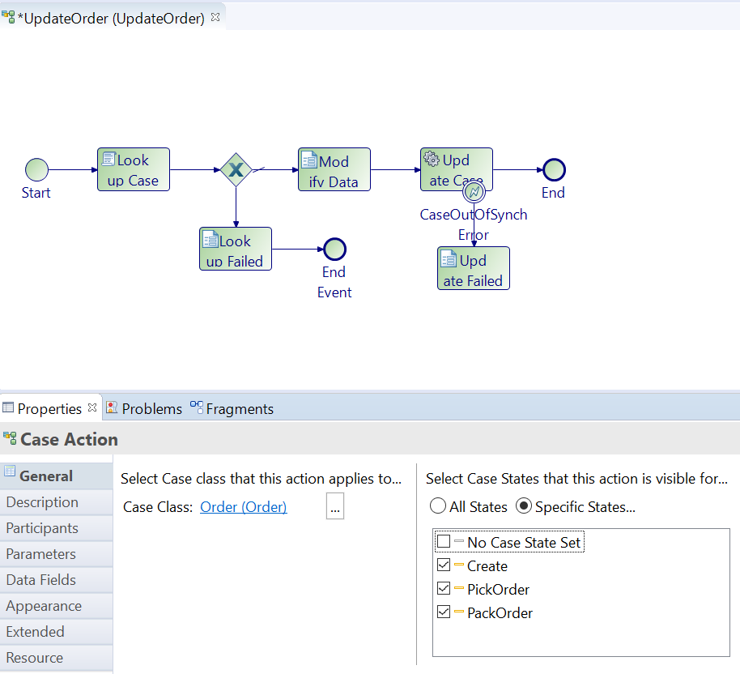

Step 7: Generate runtime deployment artifact
Right click Project → Deployment → Generate Test Artifacts

Step 8: Deploy the runtime artifact .rasc file to Admin UI

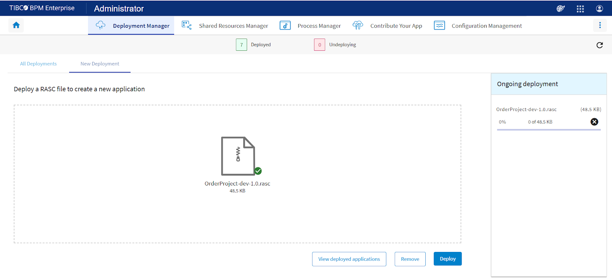

**After working this sample, you will be familiar with:**
- Creating Process project and working with Cases and case data operations
- Creating Local and Global Data abd Case Actions
- Deploying Case application in BPME UI Administration
- View and Update the Case created in the Case Management in UI
- You may import the OrderProject available in this folder in your Business Studio 5.0 version and deploy the .rasc file on Admin UI

You would like to check the BusinessObjectModel sample and the OrganisationModel sample as well as to understand the End to End flow for a Case Application where all three projects Org Model, BOM and Case Application is Deployed together.

**Checkout Related Video:** https://youtu.be/h_V1bkFs5tA

