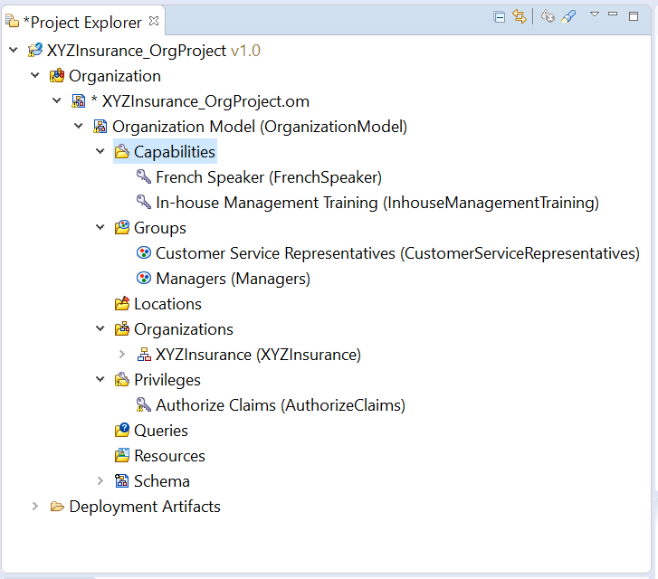
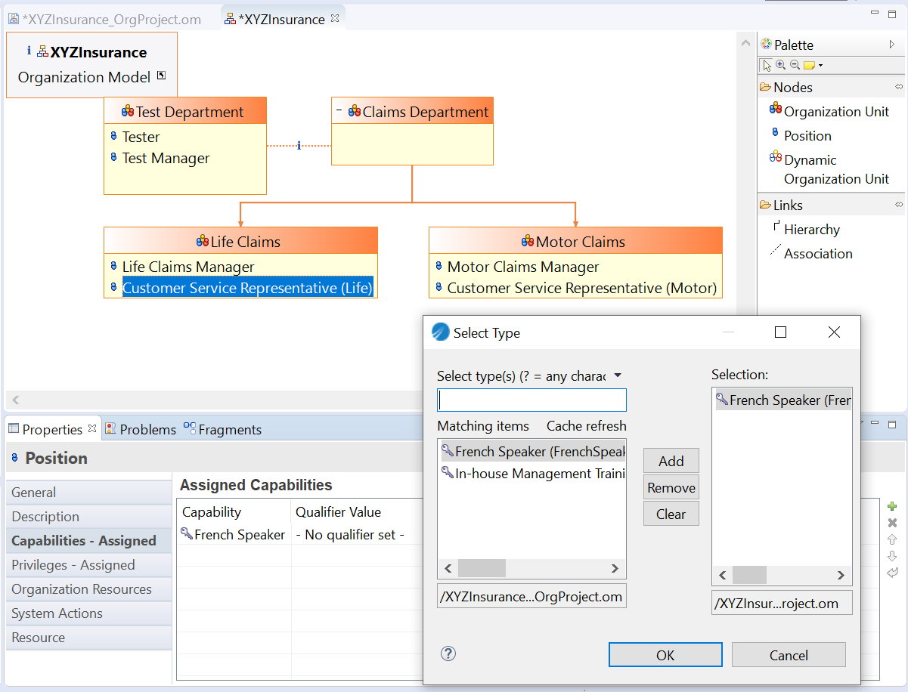
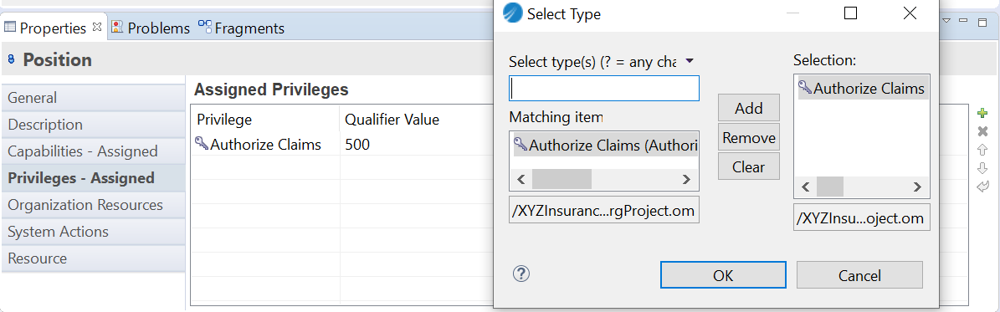
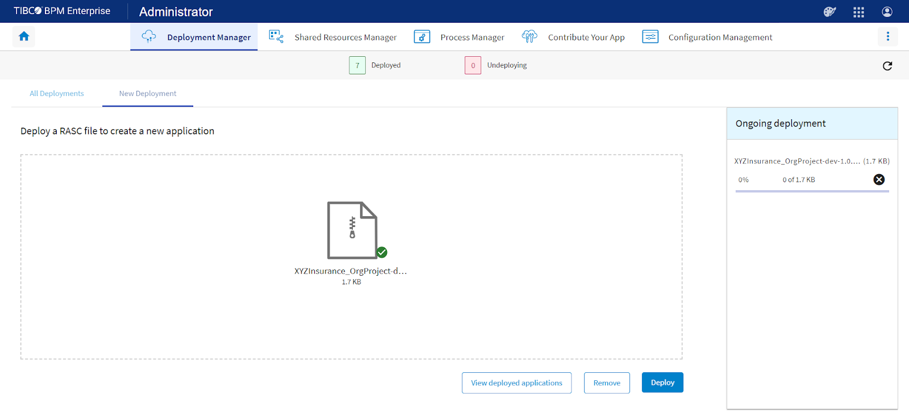
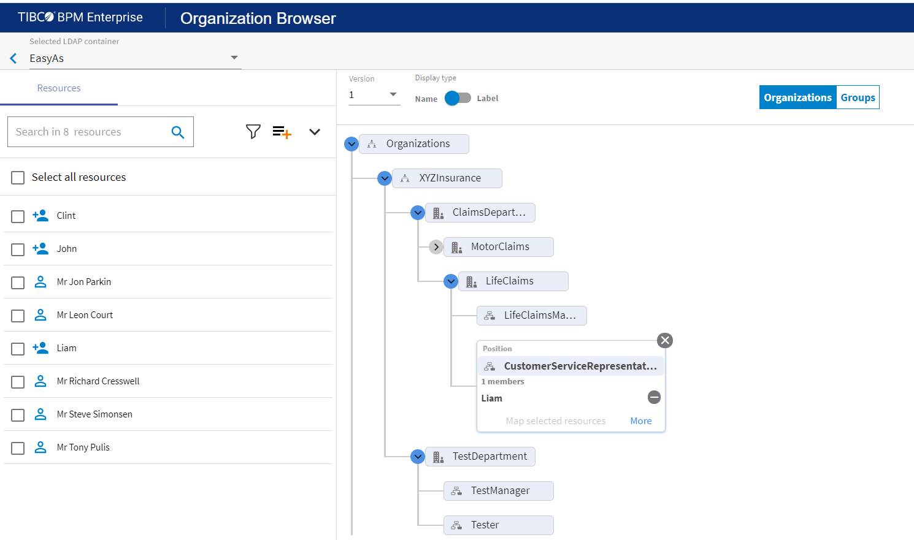

## This sample shows you how to use TIBCO Business Studio to create and populate an Organization Model.

**This sample highlights:**
- Creating an Organization Model in a new project
- Creating the basic Organization Model entities—Organizations, Organization Units and Positions and Groups
- Creating relationships between the Organization Units
- Creating Capabilities and Privileges and assigning it to Positions

Before you start working with this sample, 
>you can become familiar with TIBCO Business Studio by completing your First BPM Project tutorial here: https://docs.tibco.com/pub/bpme/5.0.0/doc/html/GUID-FFE072E2-7BEA-4834-BA17-23F6BCAD320A.html
>Doc reference for Using Organisation Model: https://docs.tibco.com/pub/business-studio-bpm-edition/5.0.0/doc/html/GUID-D941356A-06A8-4293-92C5-A5EC07E27161.html

Step 1: Create an Organisation Project

Step 2: Drag and Drop Organisation Unit, Position from Palette and create different working units and positions for the Organisation. Also use links to show Hierarchical and Association relationships between the units. Here Association relationship is shown between two different departments i.e. Test and Claim and Hierarchical relationship is showed with Claims sub-departments i.e. Life and Motor.

Step 3: Create Capabilities, Privileges and Groups

Capabilities represent the skills that are available within an organization, for example language skills or possession of a professional qualification. 
Privileges represent the authority that an Organization Unit, Position or Group can have within an organization, such as the authority to approve expenditure up to a defined amount.
- Doc reference for creating Capabilities: https://docs.tibco.com/pub/business-studio-bpm-edition/5.0.0/doc/html/GUID-DE87F032-683D-438E-8A2F-9FA893C1100F.html
- Doc reference for creating Privileges: https://docs.tibco.com/pub/business-studio-bpm-edition/5.0.0/doc/html/GUID-0AAA184C-FAA7-4C4C-8EFA-14160A5E424A.html
- Doc reference for creating Group: https://docs.tibco.com/pub/business-studio-bpm-edition/5.0.0/doc/html/GUID-4292D70F-0040-47ED-931E-E148F234CB16.html

Step 4: Assigning Capabilities and Privileges to a Position

Click the Position you want to assign the capability to and select ‘Capabilities’ in the properties tab. Now Click on the green ‘+’ button to assign the ‘French Speaker’ Capability to Customer Service Representative (Life) Position.

Click the Position you want to assign the Privileges to and select ‘Privileges’ in the properties tab. Now Click on the green ‘+’ button to assign the ‘Authorize Claims’ to Customer Service Representative (Life) Position.

Step 5: Generate runtime artifact

Once you have completed creating all the Units, Positions, Groups, Capabilities, Privileges, Locations etc you can create the runtime artifact .rasc file
Right click Project → Deployment → Generate Test Artifacts

Step 6: Deploy the runtime artifact .rasc file to Admin UI

Step 7: Assign Resources to the Org Model using Organisation Browser in UI

Here we have mapped the resource - Liam from the LDAP container to the Customer Service Representative position. So here Liam will have the mentioned capabilities and privileges as mapped in the Org model.

**After working this sample, you will be familiar with:**
- Using the graphical Organization Editor
- Creating Organization Modeler entities using the tools in the palette,
- Deploying Organization Unit in BPME UI Administration
- Assigning Resources using Organization Browser in the UI
- You may import the XYZInsurance_OrgProject available in this folder in your Business Studio 5.0 version and deploy the .rasc file on Admin UI

You would like to check the BusinessObjectModel sample and the CaseApplication sample as well as to understand the End to End flow for a Case Application where all three projects Org Model, BOM and Case Application is Deployed together.

**Checkout Related Video:** https://youtu.be/h_V1bkFs5tA

