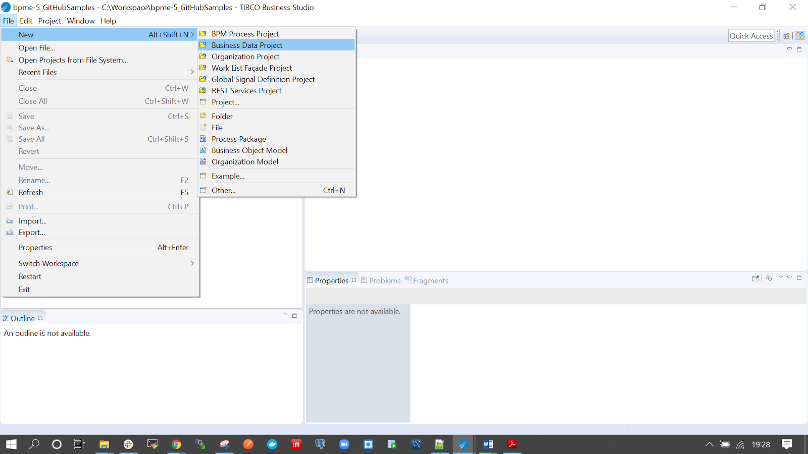
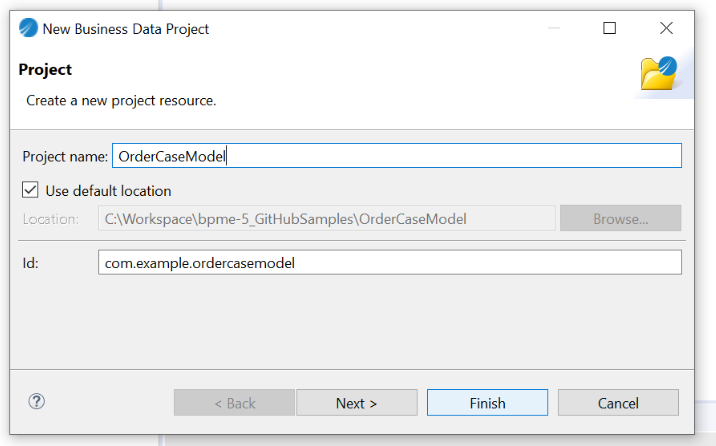
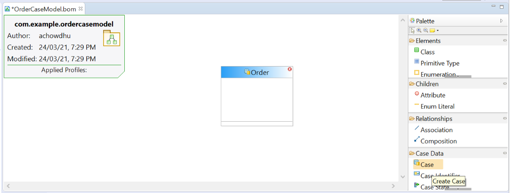
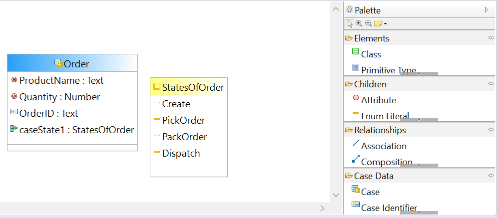
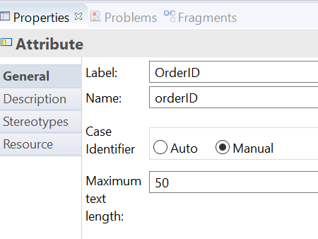
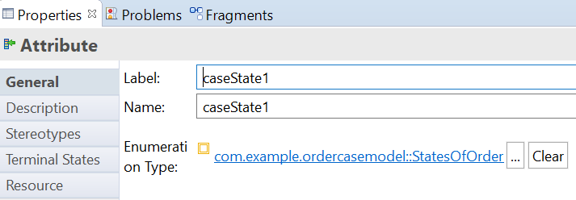
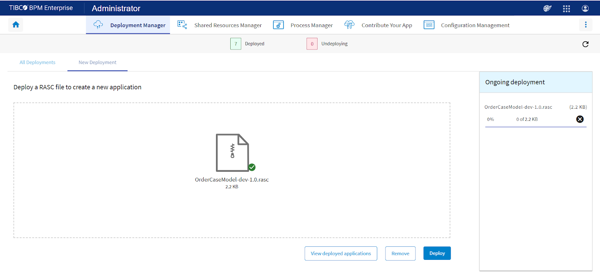

## This sample shows you how to use TIBCO Business Studio to create a business object model for Order Case data.

Case data is business data that is centrally managed and can therefore be accessed and updated by multiple BPM process applications.
Business data is structured data that contains information about real-world entities that an organization deals with, for example: Customer, Order, Orderline, Claim or Policy.

Before you start working with this sample,
>you can become familiar with TIBCO Business Studio by completing your First BPM Project tutorial here: https://docs.tibco.com/pub/bpme/5.0.0/doc/html/GUID-FFE072E2-7BEA-4834-BA17-23F6BCAD320A.html
 

Step 1: Create a Business Data Project

Step 2: Here you create a class, called Order, and add attributes to it.
Select the Create Case Class from Case Data Palette and drag and drop it

Step 3: Add Case Identifier, Case State and Attributes to the Order case Data

Here Case Identifier is OrderID type selected as Manual

And Case states is mapped to StatesOfOrder an Enumeration, selecting a terminal state is mandatory here ‘Dispatch’ is selected as Terminal state

Add Attributes to the Case class:
Product Name : Text Datatype
Quantity : Number Datatype

Similarly you can create and add more attributes.
 
You may refer to Case Data documentation here: https://docs.tibco.com/pub/business-studio-bpm-edition/5.0.0/doc/html/GUID-014A963F-5CC8-4442-8009-E5F3B79F53AA.html

Step 4: Generate runtime deployment artifact

Right click Project → Deployment → Generate Test Artifacts

Step 5: Deploy the runtime artifact .rasc file to Admin UI

**After working this sample, you will be familiar with:**
- Creating Business Object Model Project (BOM)
- Creating Case Data, Case Identifier and Case States
- Deploying BOM in BPME UI Administration
- You may import the OrderCaseModel project available in this folder in your Business Studio 5.0 version and deploy the .rasc file on Admin UI

You would like to check the OrganisationModel sample and the CaseApplication sample as well as to understand the End to End flow for a Case Application where all three projects Org Model, BOM and Case Application is Deployed together.

**Checkout Related Video:** https://youtu.be/h_V1bkFs5tA
