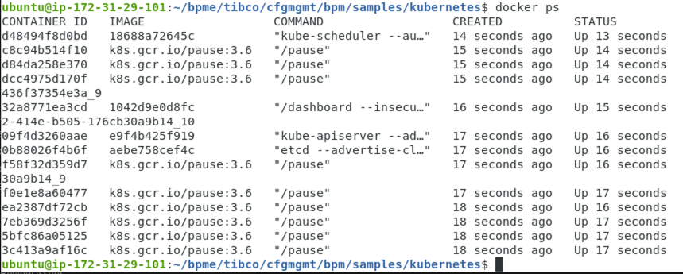
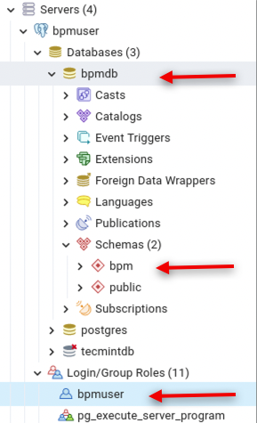
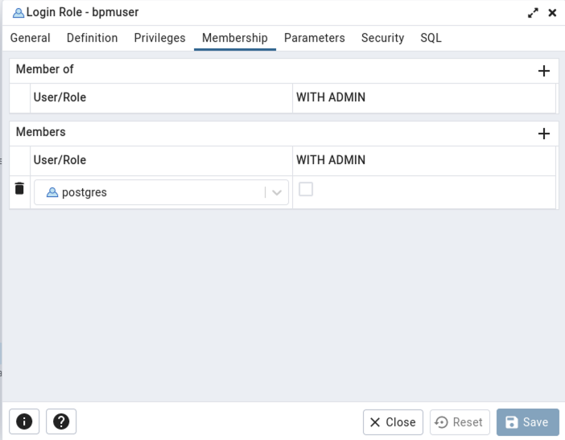
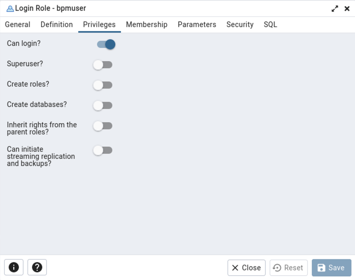

# Minikube Sample BPM Enterprise Installation
I have created an AWS AMI and i'd love to share it with anyone interested. It is a clean image with no projects deployed on it. It is an Ubunty 20-04 image with gnome-shell installed.

Contact me on ```mmyburgh@tibco.com``` if you are interested in this ami. Also please send me comments and corrections so we can make sure we improve this document for all new users.


Please read the provided instructions in the ```CONFIG_HOME/tibco/cfgmgmt/bpm/samples/kubernetes/readme.txt```  folder in conjunction with these instructions. I felt a couple of point were assumed and that why i created this document. Hopefully this will help you getting your server up quicker than i did.

Ubuntu is buggy and i found i had to restart the gnome shell on a regular bases.
```
gnome-shell --replace
```

Make sure minikube is started before you start.
```
minikube start
```

When you install Minikube it creates a seperate docker repository to be used by minikube. Before running the bpm install, make sure you use the same terminal to execute all the install scripts or execte the eval command below in every terminal window, to make sure you use the correct docker repository.
```
eval $(minikube -p minikube docker-env)
```
Do a ```docker ps``` to confirm you are on the miniukube docker instance



## Creating the BPM Enetrprise Schema 

Steps to create the BPM database schema. Follow the install docs for more database specific instructions. 

1. Create the bpm database
```createdb bpmdb```
2. Create the bpmuser using the provided script
```CONFIG_HOME/tibco/cfgmgmt/bpm/database/postgres/createuser.sql```

#### This is my database and user configuration
 

#### bpmuser Membership


#### bpmuser Privileges



The tibco/bpm/utility is used to create the BPM schema in the dastabase. Prior to running utility command, make sure your jdbc connection is working. I use the hostname linux command to get the name for my host and port 5432 is the default postgres port. I used Postgress 13, please adjust your commands and DB url according to your database used. The image also has pgAdmin4 installed.

For this to work I had to change my pg_hba.conf file like below to make sure i have the correct connectivity to the database in my environment.

```DO NOT DISABLE!
# If you change this first entry you will need to make sure that the
# database superuser can access the database using some other method.
# Noninteractive access to all databases is required during automatic
# maintenance (custom daily cronjobs, replication, and similar tasks).
#
# Database administrative login by Unix domain socket
local   all             postgres                                peer

# TYPE  DATABASE        USER            ADDRESS                 METHOD

# "local" is for Unix domain socket connections only
#local   all             all                                     peer
# IPv4 local connections:

############### Commented this out from the default file ############
#host    all             all             127.0.0.1/32            md5
# IPv6 local connections:
#host    all             all             ::1/128                 md5
############### Commented this out from the default file ############

# Allow replication connections from localhost, by a user with the
# replication privilege.
local   replication     all                                     peer
host    replication     all             127.0.0.1/32            md5
host    replication     all             ::1/128                 md5
host	all		        all		        all		                md5
```

### Utility Command for creating the database tables
```
docker run -it --rm tibco/bpm/utility:5.3.0 utility -setupDatabase execute --verbose -dbConfig url='jdbc:postgresql://ip-172-31-29-101:5432/bpmdb' username=bpmuser password=bpmuser
```


## Configure the LDAP Directory Server

This section creates the Kubernetes secrets required to store username / passwordconnection information to external LDAP systems.   This sample assumes a single LDAP connection to an Apache DS LDAP server (the kind used by the TIBCO BPM Enterprise "Developer Server" profile) thus the value for the LDAP_SYSTEM_PRINCIPAL parameter is "ou=system,uid=admin" and the value for LDAP_SYSTEM_CREDENTIALS is "secret".

When using secrets inside a yaml file in this way Kubernetes requires the secret values to be in a specific format, details of which can be found here:

See this link for how to configure the security details
```https://kubernetes.io/docs/tasks/configmap-secret/managing-secret-using-config-file/```

In the LDAP bpm-secret-ldap.yaml, to get the LDAP_SYSTEM_PRINSIPAL, execute the following string and use the output in the YAML file. This is the correct value for the Apache DS downloaded form DockerHub. See this link ```https://hub.docker.com/r/itzg/apacheds```.

```
echo -n 'UID=admin, OU=system' | base64
```
#### Output
VUlEPWFkbWluLCBPVT1zeXN0ZW0=

Note : for running the setupAdmin utility command it is important to that you need to include the dbConfig parameter as that is what inserts the info in the database to use whjen the server starts up.

```
docker run -it --rm tibco/bpm/utility:5.3.0 utility -setupAdminUser ldapAlias=system ldapDn='UID=admin, OU=system' displayName=tibco-admin -dbConfig url='jdbc:postgresql://ip-172-31-29-101:5432/bpmdb' username=bpmuser password=bpmuser
```

## Kubernetes deployment
The sample YAML filed provided by the server install are just that, samples. Ill share my updated files in the GitHub Samples repository. The files provided by the install of BPM Enterprise is out of date. My YAML files can be found here. 
```
https://github.com/TIBCOSoftware/bpme-samples/tree/master/install/BPM%20Enterprise%205.3%20YAML%20files
```

These commands will trigger the server configuration. After the bpm-ingress.yaml, the server will be started. It takes time to get the server up and running. Check the logs to see the server starting up. The bpm-deployment.yaml required the biggest changes. Parameters i needed to change was
- apiVersion : apps/v1
- the image: docker.io/tibco/bpm/runtime:5.3.0
- the host aliases and ip adresses
- the env: JDBC and LDAP values

```
kubectl apply -f bpm-namespace.yaml
kubectl apply -f bpm-secrets-ldap.yaml
kubectl apply -f bpm-secrets-db.yaml
kubectl apply -f bpm-deployment.yaml
kubectl apply -f bpm-service.yaml
kubectl apply -f bpm-ingress.yaml
```

To check if the server starts in the log files. If things go wrong and you have to restart, see the Delete installation section at the bottom of this file.

This first commands provides the pod name. Its important to add the --namespace flag to make sure you look at the correct location in your minikube instance
```
kubectl get pods --namespace=bpm
```
Use the pod name in the command below

```
kubectl logs <pod name> --namespace=bpm
```

Once the server is up and running, you can see the connection details and the general server configuration.
```
kubectl describe service --namespace=bpm
```

In my machine, after running the setup, i could not connect from the browser. I had to run the following command to open the prot. This may be a minikube issue

```
kubectl config set-context --current --namespace=bpm
ssh -i ~/.minikube/machines/minikube/id_rsa docker@$(minikube ip) -NL \*:8181:0.0.0.0:8181
```

The output of this command will be this section below. You will see it provides a public ip address that you can use to connect with or you can use 0.0.0.0.
 
The authenticity of host '192.168.49.2 (192.168.49.2)' can't be established.
ECDSA key fingerprint is SHA256:BSfbBfRynDYCW1WkazNKuKE4XW9oZqwib/s+YfwW7cc.
Are you sure you want to continue connecting (yes/no/[fingerprint])? y
Please type 'yes', 'no' or the fingerprint: yes
Warning: Permanently added '192.168.49.2' (ECDSA) to the list of known hosts.

Use this url to connect to the workspace.
```
http://0.0.0.0:8181/apps/work-manager/#/overview
```
Or in my case 
```
http://192.168.49.2:8181/apps/login/index.html
```

## Restarting the AMI 
Run these commands to get the server up after restart.
```
docker run -d --name apacheds -p 389:10389 itzg/apacheds
minikube start
eval $(minikube -p minikube docker-env)
kubectl config set-context --current --namespace=bpm
ssh -i ~/.minikube/machines/minikube/id_rsa docker@$(minikube ip) -NL \*:8181:0.0.0.0:8181
```

## Delete installation 
To delete the yaml’s in case something goes wrong. This command deletes the namespace on minikube and reset the environment. 
```
kubectl delete -f bpm-namespace.yaml
```
